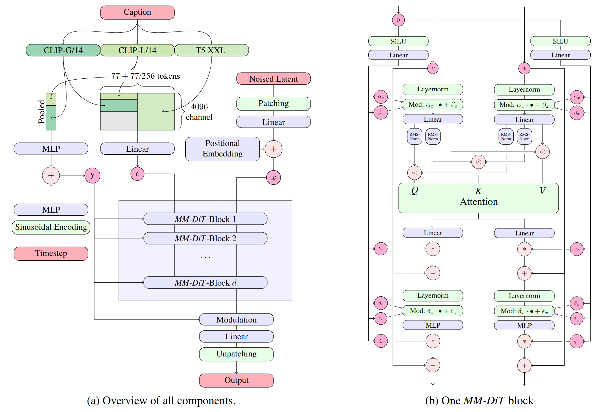

# Stable Diffusion 3.5 Large


## Model




[Stable Diffusion 3.5 Large](https://stability.ai/news/introducing-stable-diffusion-3-5) is a Multimodal Diffusion Transformer (MMDiT) text-to-image model that features improved performance in image quality, typography, complex prompt understanding, and resource-efficiency.

Please note: This model is released under the [Stability Community License](https://stability.ai/community-license-agreement). Visit [Stability AI](https://stability.ai/license) to learn or [contact us](https://stability.ai/enterprise) for commercial licensing details.


### Model Description

- **Developed by:** Stability AI
- **Model type:** MMDiT text-to-image generative model
- **Model Description:** This model generates images based on text prompts. It is a [Multimodal Diffusion Transformer](https://arxiv.org/abs/2403.03206) that use three fixed, pretrained text encoders, and with QK-normalization to improve training stability. 

### License

- **Community License:**  Free for research, non-commercial, and commercial use for organizations or individuals with less than $1M in total annual revenue. More details can be found in the [Community License Agreement](https://stability.ai/community-license-agreement). Read more at https://stability.ai/license.
- **For individuals and organizations with annual revenue above $1M**: please [contact us](https://stability.ai/enterprise) to get an Enterprise License.

### Model Sources

For local or self-hosted use, we recommend [ComfyUI](https://github.com/comfyanonymous/ComfyUI) for node-based UI inference, or [diffusers](https://github.com/huggingface/diffusers) or [GitHub](https://github.com/Stability-AI/sd3.5) for programmatic use.

- **ComfyUI:** [Github](https://github.com/comfyanonymous/ComfyUI), [Example Workflow](https://comfyanonymous.github.io/ComfyUI_examples/sd3/)
- **Huggingface Space:** [Space](https://huggingface.co/spaces/stabilityai/stable-diffusion-3.5-large)
- **Diffusers**: [See below](#using-with-diffusers).
- **GitHub**: [GitHub](https://github.com/Stability-AI/sd3.5).

- **API Endpoints:**
  - [Stability AI API](https://platform.stability.ai/docs/api-reference#tag/Generate/paths/~1v2beta~1stable-image~1generate~1sd3/post)
  - [Replicate](https://replicate.com/stability-ai/stable-diffusion-3.5-large)
  - [Deepinfra](https://deepinfra.com/stabilityai/sd3.5)


### Implementation Details

- **QK Normalization:** Implements the QK normalization technique to improve training Stability.

- **Text Encoders：**
    - CLIPs: [OpenCLIP-ViT/G](https://github.com/mlfoundations/open_clip), [CLIP-ViT/L](https://github.com/openai/CLIP/tree/main), context length 77 tokens
    - T5: [T5-xxl](https://huggingface.co/google/t5-v1_1-xxl), context length 77/256 tokens at different stages of training

- **Training Data and Strategy:**
    
    This model was trained on a wide variety of data, including synthetic data and filtered publicly available data. 

For more technical details of the original MMDiT architecture, please refer to the [Research paper](https://stability.ai/news/stable-diffusion-3-research-paper).


### Model Performance

See [blog](https://stability.ai/news/introducing-stable-diffusion-3-5) for our study about comparative performance in prompt adherence and aesthetic quality. 


## File Structure

Click here to access the [Files and versions tab](https://huggingface.co/stabilityai/stable-diffusion-3.5-large/tree/main)

```│
├── text_encoders/  
│   ├── README.md
│   ├── clip_g.safetensors
│   ├── clip_l.safetensors
│   ├── t5xxl_fp16.safetensors
│   └── t5xxl_fp8_e4m3fn.safetensors
│
├── README.md
├── LICENSE
├── sd3_large.safetensors
├── SD3.5L_example_workflow.json
└── sd3_large_demo.png

** File structure below is for diffusers integration**
├── scheduler/
├── text_encoder/
├── text_encoder_2/
├── text_encoder_3/
├── tokenizer/
├── tokenizer_2/
├── tokenizer_3/
├── transformer/
├── vae/
└── model_index.json
```

## Using with Diffusers
Upgrade to the latest version of the [🧨 diffusers library](https://github.com/huggingface/diffusers)
```
pip install -U diffusers
```

and then you can run
```py
import torch
from diffusers import StableDiffusion3Pipeline

pipe = StableDiffusion3Pipeline.from_pretrained("stabilityai/stable-diffusion-3.5-large", torch_dtype=torch.bfloat16)
pipe = pipe.to("cuda")

image = pipe(
    "A capybara holding a sign that reads Hello World",
    num_inference_steps=28,
    guidance_scale=3.5,
).images[0]
image.save("capybara.png")
```

### Quantizing the model with diffusers

Reduce your VRAM usage and have the model fit on 🤏 VRAM GPUs

```
pip install bitsandbytes
```

```py
from diffusers import BitsAndBytesConfig, SD3Transformer2DModel
from diffusers import StableDiffusion3Pipeline
import torch

model_id = "stabilityai/stable-diffusion-3.5-large"

nf4_config = BitsAndBytesConfig(
    load_in_4bit=True,
    bnb_4bit_quant_type="nf4",
    bnb_4bit_compute_dtype=torch.bfloat16
)
model_nf4 = SD3Transformer2DModel.from_pretrained(
    model_id,
    subfolder="transformer",
    quantization_config=nf4_config,
    torch_dtype=torch.bfloat16
)

pipeline = StableDiffusion3Pipeline.from_pretrained(
    model_id, 
    transformer=model_nf4,
    torch_dtype=torch.bfloat16
)
pipeline.enable_model_cpu_offload()

prompt = "A whimsical and creative image depicting a hybrid creature that is a mix of a waffle and a hippopotamus, basking in a river of melted butter amidst a breakfast-themed landscape. It features the distinctive, bulky body shape of a hippo. However, instead of the usual grey skin, the creature's body resembles a golden-brown, crispy waffle fresh off the griddle. The skin is textured with the familiar grid pattern of a waffle, each square filled with a glistening sheen of syrup. The environment combines the natural habitat of a hippo with elements of a breakfast table setting, a river of warm, melted butter, with oversized utensils or plates peeking out from the lush, pancake-like foliage in the background, a towering pepper mill standing in for a tree.  As the sun rises in this fantastical world, it casts a warm, buttery glow over the scene. The creature, content in its butter river, lets out a yawn. Nearby, a flock of birds take flight"

image = pipeline(
    prompt=prompt,
    num_inference_steps=28,
    guidance_scale=4.5,
    max_sequence_length=512,
).images[0]
image.save("whimsical.png")
```

### Fine-tuning

Please see the fine-tuning guide [here](https://stabilityai.notion.site/Stable-Diffusion-3-5-Large-Fine-tuning-Tutorial-11a61cdcd1968027a15bdbd7c40be8c6).


## Uses

### Intended Uses

Intended uses include the following:
* Generation of artworks and use in design and other artistic processes.
* Applications in educational or creative tools.
* Research on generative models, including understanding the limitations of generative models.

All uses of the model must be in accordance with our [Acceptable Use Policy](https://stability.ai/use-policy).

### Out-of-Scope Uses

The model was not trained to be factual or true representations of people or events.  As such, using the model to generate such content is out-of-scope of the abilities of this model.

## Safety

As part of our safety-by-design and responsible AI deployment approach, we take deliberate measures to ensure Integrity starts at the early stages of development. We implement safety measures throughout the development of our models. We have implemented safety mitigations that are intended to reduce the risk of certain harms, however we recommend that developers conduct their own testing and apply additional mitigations based on their specific use cases.  
For more about our approach to Safety, please visit our [Safety page](https://stability.ai/safety).

### Integrity Evaluation

Our integrity evaluation methods include structured evaluations and red-teaming testing for certain harms.  Testing was conducted primarily in English and may not cover all possible harms.  

### Risks identified and mitigations:

* Harmful content:  We have used filtered data sets when training our models and implemented safeguards that attempt to strike the right balance between usefulness and preventing harm. However, this does not guarantee that all possible harmful content has been removed. TAll developers and deployers should exercise caution and implement content safety guardrails based on their specific product policies and application use cases.
* Misuse: Technical limitations and developer and end-user education can help mitigate against malicious applications of models. All users are required to adhere to our [Acceptable Use Policy](https://stability.ai/use-policy), including when applying fine-tuning and prompt engineering mechanisms. Please reference the Stability AI Acceptable Use Policy for information on violative uses of our products.
* Privacy violations: Developers and deployers are encouraged to adhere to privacy regulations with techniques that respect data privacy.

### Contact

Please report any issues with the model or contact us:

* Safety issues:  safety@stability.ai
* Security issues:  security@stability.ai
* Privacy issues:  privacy@stability.ai
* License and general: https://stability.ai/license
* Enterprise license: https://stability.ai/enterprise


